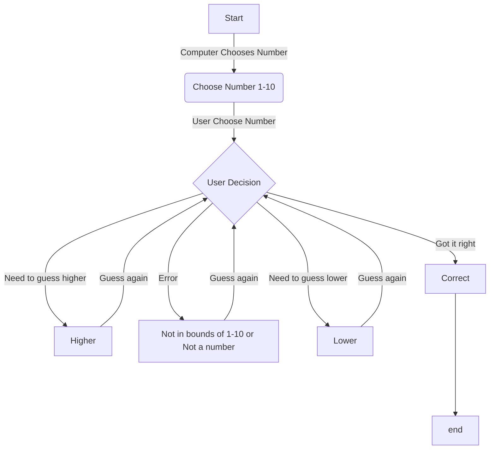

>This flowchart shows how a guessing game would work when a computer chooses a number between 1-10. It accounts for error entries and if the user input is too high or too low. If the use guesses the correct number, the program ends.
